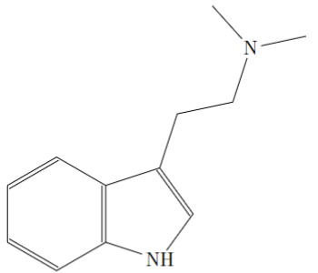
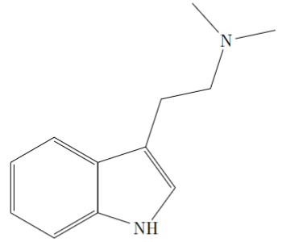

::github{repo="Benzyl-titanium/BabyChem"}

# BabyChem 基础有机化学


## 想法

将手写笔记用 latex 写出来

## 进度

- [x] 第一章
  - [x] 1.1-1.3
- [x] 第二章
  - [x] 2.1-2.5
- [ ] 第三章
  - [ ] 3.1-3.4

## 遇到的困难

里面全是史山代码，tex 里好多报错，不知道怎么解决，呜呜呜  
全是化学式结构图，能量曲线，能级图，好难画  
为了和手写笔记基本上吻合，花了很多功夫

## to chemfig

先看看效果吧，这是他生成的并打印出来的



```tex
\chemfig{-[:312]N(-[:12])-[:252]-[:192]-[:252]=_[:306]-[:234]\mcfbelow{N}{H}-[:162]=^[:90](-[:18])-[:150]=^[:210]-[:270]=^[:330](-[:30])}
```

这是手写的并打印的



```tex
\chemfig{*6(-=(*5(-{N}{H}-=(-(-[::-60](-[::60]N(-[::-60])(-[::60]))))--))-=-=)}
```

[Emacs](https://www.gnu.org/software/emacs/download.html)加上`tochemfig.el`这个插件后有很多选项功能具体查看[tochemfig](https://github.com/gicrisf/tochemfig)，不过他的代码的六元环和五元环的*6/*5 没用上，感觉不精简？也可能是我没用完整他的插件，有个注意的就是 Emacs 的复制粘贴快捷键等都不是和 win 一样的，这点有点不习惯

这个插件依赖于 python 和 mol2chemfigPy3

总得来说还是一个非常不错的软件和插件，所以我发现了宝藏，我会用他来打第一个模板，这里要致谢一下

## 致谢

- [szaboqc](https://github.com/Usu171/szaboqc)
- [tochemfig](https://github.com/gicrisf/tochemfig)

## BabyChem 基础有机化学讲解视频

<iframe width="100%" height="468" src="//player.bilibili.com/player.html?bvid=BV11U4y1x7GL&p=1" scrolling="no" border="0" frameborder="no" framespacing="0" allowfullscreen="true"> </iframe>

## BabyChem 基础有机化学手写笔记

<iframe width="100%" height="468" src="//player.bilibili.com/player.html?bvid=BV1MDHLe6EUo&p=1" scrolling="no" border="0" frameborder="no" framespacing="0" allowfullscreen="true"> </iframe>

## 文件下载

- **[BabyChem 基础有机化学手写笔记.pdf](https://github.com/Benzyl-titanium/BabyChem/releases/download/organic-chemistry/BabyChem.pdf)**
