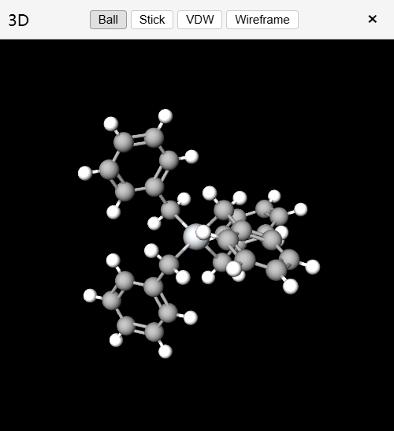

::github{repo="biantailab/MarvinJS"}

# <a href="https://marvinjs.pages.dev" target="_blank">化学结构编辑器 Marvin JS<a>

<iframe src="https://marvinjs.pages.dev" style="width: 100%; height: 100vh; border: none; border-radius: 10px;margin: 10px auto"></iframe>

# 功能

- smiles 与结构式互相转换
- PubChem 搜索
- HNMR 搜索
- Example:
  - Benzyl titanium
  - Pregabalin
  - Fluoxetine
- 获取 CAS
- 3D 可视化
  - 可移动窗口
  - 可与结构式，smiles 进行实时更新
  - 种类
    |  |  |  |  |
    |---|---|---|---|
